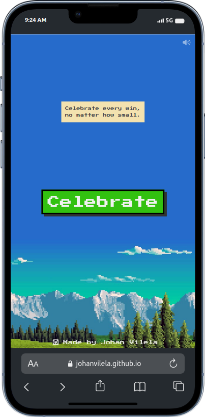
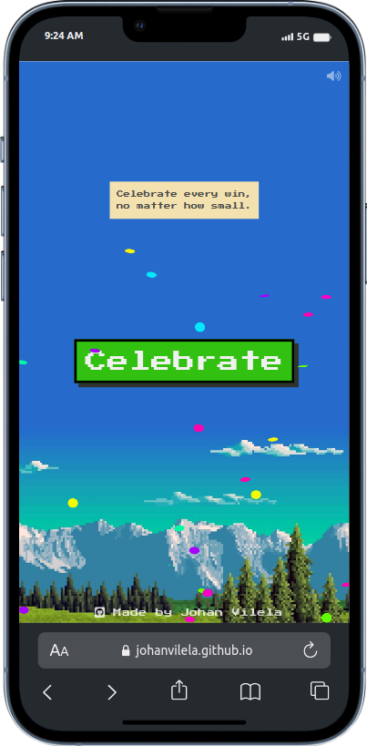

  

<h1 align="center">
  Celebrate
</h1>

<h4 align="center">
  Celebrate every win, no matter how small.
</h4>

  <a href="https://johanvilela.github.io/celebrate/" target="_blank">Demo</a> •
  <a href="#key-features">Key Features</a>

    
    

## Key Features

- 8-bit Style
- Ta-da Sound
- Confetti Effect
- Mute function
- Mobile First
- Only HTML, CSS & Javascript
